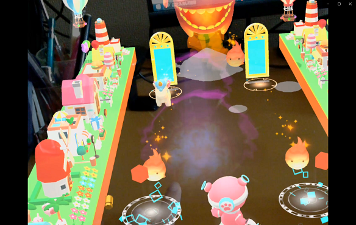
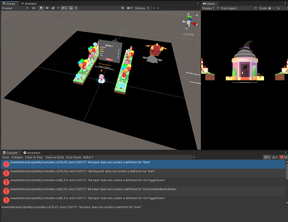
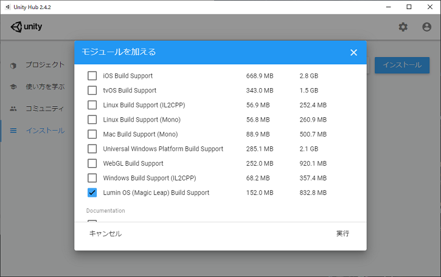
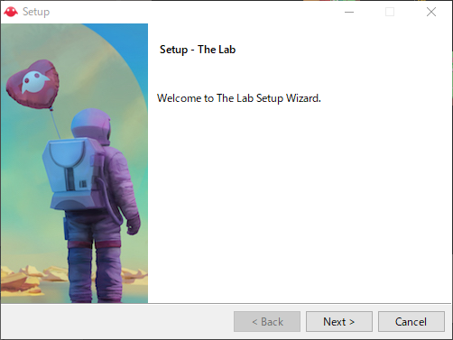
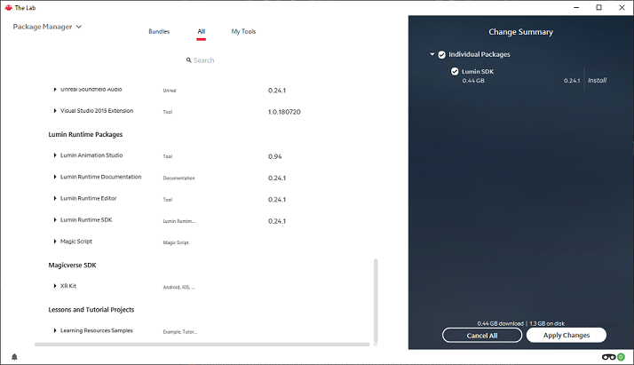
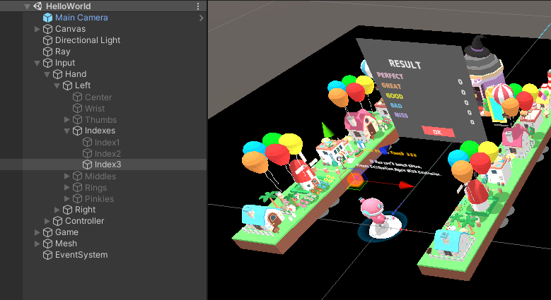

# MuseTable_AR

2020年9月に [Magic Leap Challenge](https://x-garden.co.jp/ml-challenge) に参加した際に作ったARゲームです。

https://youtu.be/ckV3ReiJ7og

## ディレクトリ構成

`Assets/Mine` 以下に置いてあるものが自分で用意したものです。

## 初期設定

※ プロジェクトの実行シーンは `HelloWorld` シーンです。

MagicLeapSDKありきで作ったプロジェクトなので、開いたらエラーが出ます。

エディタで動かすための手順を記載していきます。

### 1. Unityインストール

開発はUnity2019.3.15で行われています。

ただエディタで動かすだけならバージョンの指定は厳格でなく、Unityは2019.3 or 2019.4系のどれかで開いていただければ大丈夫なはずです。

また、UnityHubで `LuminOS` のサポートモジュールもインストールしておいてください。

### 2. The Labインストール

「[The Lab](https://developer.magicleap.com/downloads/lab)」 というMagicLeap開発をサポートするソフトウェアをDL後、インストールしてください。

### 3. Lumin SDKインストール

The Lab 内の PackageManager から LuminSDK を選択してインストールします。

バージョンは最新で大丈夫です。（今回は0.24.1を使用）

### 4. Unity起動

ここまででEditorで動かす手順は整った..はずです。

UnityのPlatformをLuminOSに切り替えると先程のエラーが消えていると思います。

### 5. ゲームテスト

シーン中央に置かれている２つの赤いCubeがそれぞれ左右の人差し指をエミュレートしています。

※CUbeはヒエラルキー上では `Input/Hand/[Left, Right]/Indexes/Index3` というパスに存在します。

エディタ上では以下のようにこのCubeをシーンビューで動かすことでゲームのテストを行っていました。

注意点として、Leftの赤いCubeは左のレーンのみに対応し、Rightは右のみに対応しているという点です。Cubeを魔法陣に当てても反応しない場合、確認してみてください。

また、実行時にエラーがコンソールに出力されますが、エディタで動かしている分には問題ないので無視してください。
